# robotic_hand_pcb

Robotic hand project for actuators/power electronics and sensors/instrumentation
university courses (PCB hardware).

STM32F446RE firmware
repo: [robotic_hand](https://github.com/danielljeon/robotic_hand).

- System architecture is explained in further detail in this software repo.

---

  
Table of Contents

<!-- TOC -->
* [robotic_hand_pcb](#robotic_hand_pcb)
  * [1 Overview](#1-overview)
  * [2 Board Specifications](#2-board-specifications)
    * [2.1 Connectors](#21-connectors)
      * [2.1.1 BAT+/VIN Terminals](#211-batvin-terminals)
    * [2.2 Switches & Jumpers](#22-switches--jumpers)
    * [2.3 Test Pads](#23-test-pads)
  * [3 Release Notes](#3-release-notes)
    * [3.1 v0.1.0](#31-v010)
    * [3.2 v0.2.0](#32-v020)
  * [4 Development Process](#4-development-process)
    * [4.1 Simulations: OrCAD X (PSpice)](#41-simulations-orcad-x-pspice)
    * [4.2 PCB Design: KiCad](#42-pcb-design-kicad)
    * [4.3 Firmware: CLion and STM32CubeMX](#43-firmware-clion-and-stm32cubemx)
    * [4.4. Version Control: GitHub](#44-version-control-github)
  * [5 Switching Buck Regulator](#5-switching-buck-regulator)
    * [5.1 Load Current Estimation](#51-load-current-estimation)
    * [5.2 Switching Frequency Selection](#52-switching-frequency-selection)
    * [5.3 Inductor Selection](#53-inductor-selection)
    * [5.4 Output Capacitor Selection](#54-output-capacitor-selection)
    * [5.5 Input Capacitor Selection](#55-input-capacitor-selection)
    * [5.6 PSpice Simulation](#56-pspice-simulation)
      * [5.6.1 Schematic](#561-schematic)
      * [5.6.2 Output](#562-output)
      * [5.6.3 Fast Fourier Transform (FFT)](#563-fast-fourier-transform-fft)
  * [💖 Sponsors](#-sponsors)
    * [PCBWay](#pcbway)
      * [Why PCBWay?](#why-pcbway)
<!-- TOC -->

---

This project is sponsored by **PCBWay**. You can learn more about their valuable
support here: [💖 Sponsors/PCBWay](#pcbway).

---

## 1 Overview

|                          Robotic Hand Assembly                          |
|:-----------------------------------------------------------------------:|
| 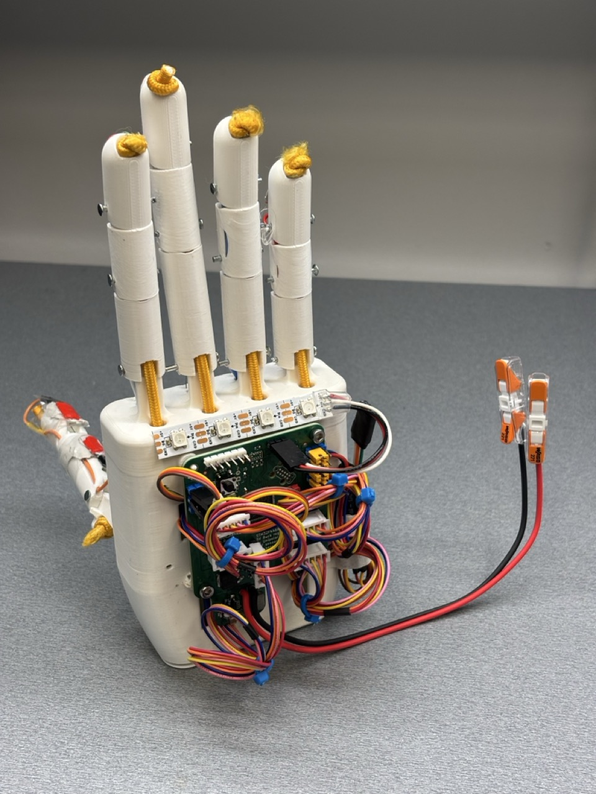 |

|                                 Top                                 |                                  Bottom                                   |
|:-------------------------------------------------------------------:|:-------------------------------------------------------------------------:|
|     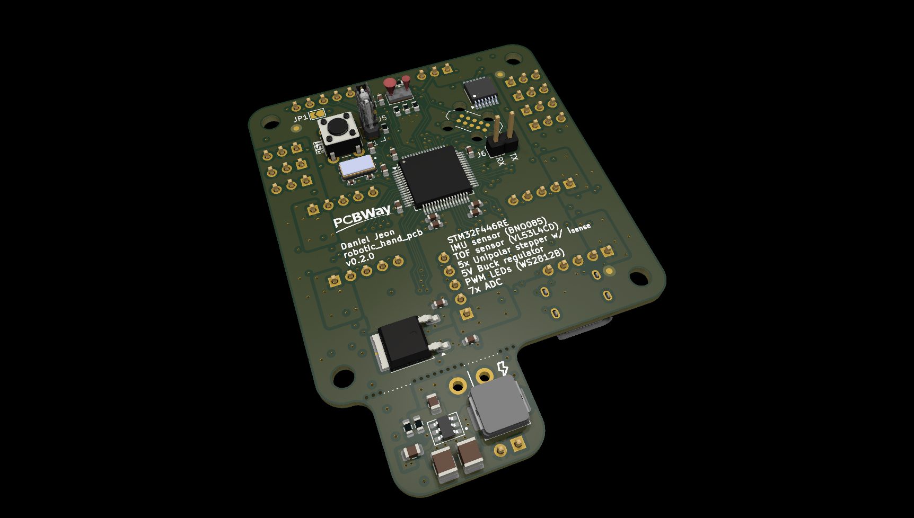      |     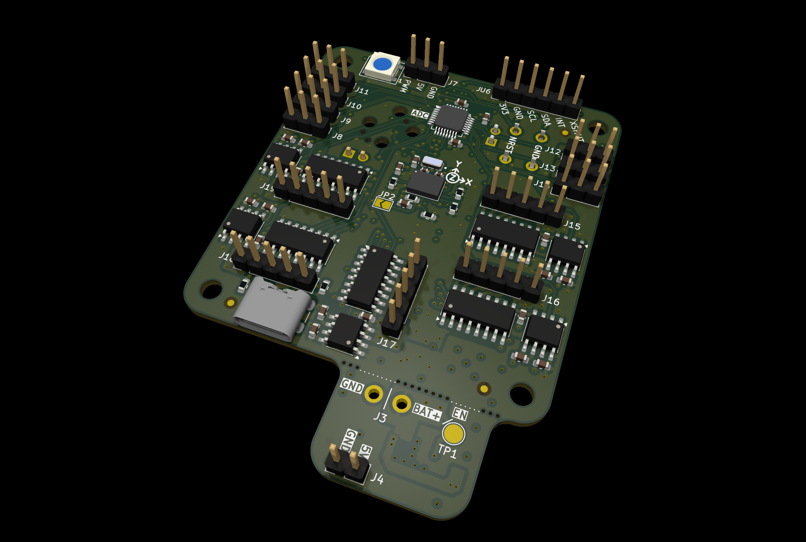      |
| 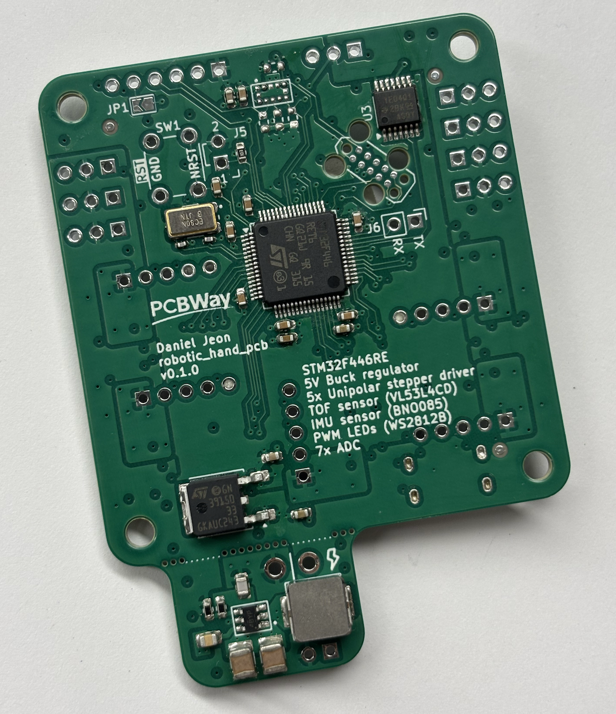 | 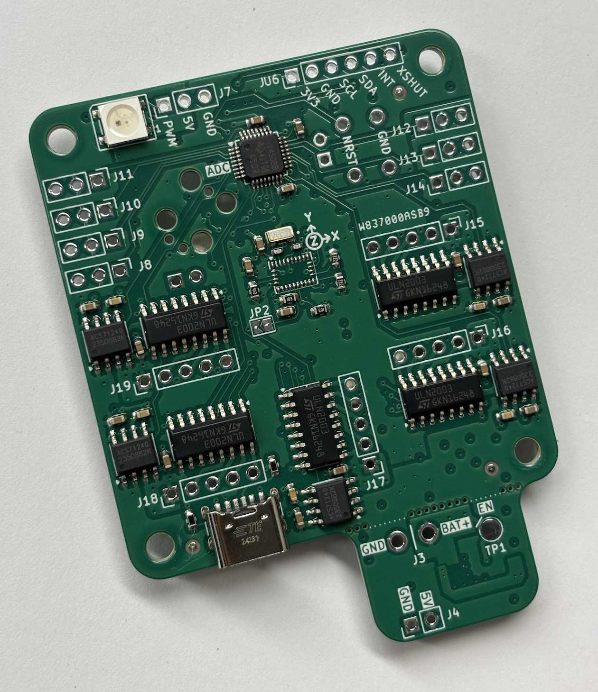 |

- Pictures show v0.1.0 production run.

---

## 2 Board Specifications

### 2.1 Connectors

| Connector          |  Ref  | Description                                                                                                              |
|--------------------|:-----:|--------------------------------------------------------------------------------------------------------------------------|
| VL53L4CD Breakout  | (J)U6 | Breakout connector for TOF sensor                                                                                        |
| USB-C 5 V power    |  J1   | Power only USB-C, primary 5 V source                                                                                     |
| Tag-Connect TC2050 |  J2   | Programming/debug connector                                                                                              |
| BAT+/VIN           |  J3   | Pin 1: (GND) Ground, Pin 2: (BAT+) Power supply (> 5 V, <= 36 V), see [2.1.1 BAT+/VIN Terminals](#211-batvin-terminals). |
| 5V Breakout        |  J4   | 5 V analog input 7                                                                                                       |
| BOOT0 jumper       |  J5   | Open for run flash memory (pull-down on open)                                                                            |
| UART Breakout      |  J6   | General purpose UART breakout                                                                                            |
| WS2812B PWM LEDs   |  J7   | 5 V Addressable LED breakout                                                                                             |
| ADC 1              |  J8   | 5 V analog input 1                                                                                                       |
| ADC 2              |  J9   | 5 V analog input 2                                                                                                       |
| ADC 3              |  J10  | 5 V analog input 3                                                                                                       |
| ADC 4              |  J11  | 5 V analog input 4                                                                                                       |
| ADC 5              |  J12  | 5 V analog input 5                                                                                                       |
| ADC 6              |  J13  | 5 V analog input 6                                                                                                       |
| ADC 7              |  J14  | 5 V analog input 7                                                                                                       |
| Unipolar Motor 1   |  J15  | Robotic finger 1 motor                                                                                                   |
| Unipolar Motor 2   |  J16  | Robotic finger 2 motor                                                                                                   |
| Unipolar Motor 3   |  J17  | Robotic finger 3 motor                                                                                                   |
| Unipolar Motor 4   |  J18  | Robotic finger 4 motor                                                                                                   |
| Unipolar Motor 5   |  J19  | Robotic finger 5 motor                                                                                                   |

- All generic breakout connectors are standard 2.54 mm pitch Harwin connectors
  except for the BAT+/VIN connector.

#### 2.1.1 BAT+/VIN Terminals

The battery or supply terminals for the LMR51430 (5 V) buck regulator are custom
sizes designed for higher gauge wires.

The **recommended supply voltage is 12 V**, however the LMR51430 has a
theoretical range up to 36 volts.

- Hole: 1.5 mm diameter.
- Pad: 2.5 mm diameter.
- Pitch: 4 mm (center-to-center distance).

### 2.2 Switches & Jumpers

| Switch/Jumper         | Ref | Description                                           |
|-----------------------|:---:|-------------------------------------------------------|
| MCU NRESET switch     | SW1 | Generic 6 mm TH button, push to reset                 |
| VL53L4CD breakout INT | JP1 | Open = no breakout, closed = bridge breakout INT line |
| BNO085 clock select   | JP2 | Open = crystal, closed = external/internal            |

### 2.3 Test Pads

| Test Pad        | Ref | Description                                                       |
|-----------------|:---:|-------------------------------------------------------------------|
| LMR51430 enable | TP1 | Buck converter enable pin (tied to VIN Battery supply by default) |

---

## 3 Release Notes

### 3.1 v0.1.0

- Production oriented 4-layer board variant.
    - Designed for single production run given course project requirement.
- Order date: 2025/02/23.
- Order number: `W837000ASB9`.

### 3.2 v0.2.0

- Updated PCB for hand reworks on `v0.1.0` to get full ADS114S08 feature
  functionality.
    - Requires software changes for this functionality, thus semantic versioning
      minor value was moved to `2`.
    - Rework shown in picture below:
      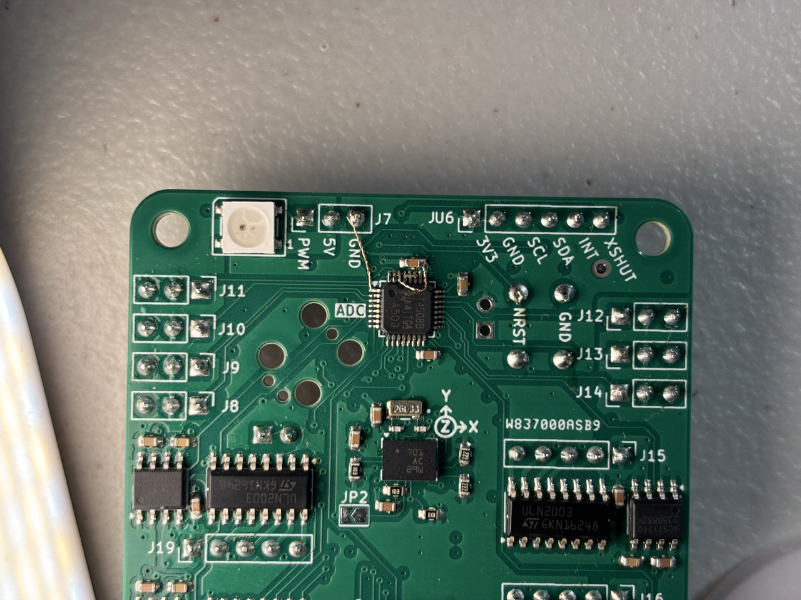

---

## 4 Development Process

### 4.1 Simulations: OrCAD X (PSpice)

[OrCAD X (PSpice)](https://www.cadence.com/en_US/home/tools/pcb-design-and-analysis/analog-mixed-signal-simulation/pspice.html)
by Cadence was used for circuit simulation and evaluation.

Since this project relies heavily on Texas Instruments (TI) components (ADC ICs,
Darlington transistor arrays, and buck regulators), PSpice was chosen for design
verification and virtual testing. TI provides official PSpice models, making
simulations more accurate and reliable.

Initially, [PSpice for TI](https://www.ti.com/tool/PSPICE-FOR-TI) (a free
version limited to TI parts) was used. Upgrading to OrCAD X enabled full
compatibility and broader simulation capabilities.

### 4.2 PCB Design: KiCad

[KiCad](https://www.kicad.org/) was chosen for PCB design due to its ease of use
as a free, open-source software. Additionally, prior experience and personal
preference played a key role in the decision.

### 4.3 Firmware: CLion and STM32CubeMX

[CLion](https://www.jetbrains.com/clion/)
and [STM32CubeMX](https://www.st.com/en/development-tools/stm32cubemx.html) from
STMicroelectronics were selected based on prior experience and personal
preference. STM32CubeMX is utilized for initial component selection, pin
configuration, and HAL software generation, while CLion is used for general C
firmware development. For more details,
see [robotic_hand](https://github.com/danielljeon/robotic_hand).

### 4.4. Version Control: GitHub

[GitHub](https://github.com/) was chosen for its efficiency in version control
and support for Actions automations. These automations facilitated testing,
validation, and various manufacturing-related processes for both hardware and
software development.

---

## 5 Switching Buck Regulator

The LMR51430 was chosen for its wide input voltage range of 4.5 V to 36 V, high
output current of 3 A and overall efficiency.

> Datasheet: Datasheet: LMR51430 SLUSEF4A – JUNE 2022 – REVISED NOVEMBER 2022.

> Big thanks, as always, to the amazing publicly available resources online 👑:
> 1. [Switching Regulator PCB Design - Phil's Lab #60](https://www.youtube.com/watch?v=AmfLhT5SntE)
> 2. [Switching Regulator Component Selection & Sizing - Phil's Lab #71](https://www.youtube.com/watch?v=FqT_Ofd54fo)

### 5.1 Load Current Estimation

The expected current load is as follows:

| Load              | Current | n |
|-------------------|---------|---|
| Motors + drivers  | 500 mA  | 5 |
| WS2812B LEDs      | 60 mA   | 1 |
| 3.3 V ICs via LDO | 100 mA  | 1 |

Approximate total current draw: 2660 mA = 2.66 A at 5 V.

In a real-world engineering scenario, current draw would be estimated using more
accurate models and measured across various revisions of development boards.
However, due to budget constraints and the need to support future higher-voltage
applications, a 3 A buck regulator was chosen, as it is a commonly available and
cost-effective option.

While this provides only an 11% safety margin, it was deemed acceptable for
early research and educational purposes. In the worst-case scenario, the board
can also be powered by an external 5 V power supply if needed.

### 5.2 Switching Frequency Selection

The LMR51430 is capable of 500 kHz and 1.1 MHz switching. The design opted for
the 500 kHz configuration for reduced switching noise and its application of
motor current driving. A lower switching frequency would theoretically reduce
switching losses and improve efficiency at high current draw.

### 5.3 Inductor Selection

The following calculations are based on the recommendations provided in the
LMR51430 datasheet.

The desired peak-to-peak ripple current is given by the following:

$$\Delta i_L = \frac{V_{OUT} \times \left( V_{IN \space MAX} - V_{OUT} \right)}{V_{IN \space MAX} \times L \times f_{SW}}$$

- $L$ = Inductance driving ripple.

The minimum inductor specification is given by:

$$L_{min} = \frac{V_{\text{IN MAX}} - V_{\text{OUT}}}{I_{\text{OUT}} \times K_{\text{IND}}} \times \frac{V_{\text{OUT}}}{V_{\text{IN MAX}} \times f_{\text{SW}}}$$
$$L_{min} = \frac{12 \space \text{V} - 5 \space \text{V}}{3 \space \text{A} \times 0.3} \times \frac{5 \space \text{V}}{12 \space \text{V} \times 500 \times 10^{3} \space \text{Hz}}$$
$$L_{min} = 6.84 \times 10^{-6} \space \text{H} = 6.84 \space \mathrm{\mu H}$$

- $K_{IND}$ = Coefficient representing the inductor ripple current as a fraction
  of the maximum output current, utilizing 0.3 for this project.
    - > A reasonable value of KIND must be 20% to 60% of maximum IOUT supported
      > by the converter.
      >
      > - Datasheet section: _9.2.2.4 Inductor Selection_.
- $f_{\text{SW}}$ = Switching frequency, 500 kHz chosen.
- $V_{\text{IN MAX}}$ = Input voltage, expected 12 V with ±1 V, 13 V.
- $V_{\text{OUT}}$ = Output voltage, 5 V.
- $I_{\text{OUT}}$ = Output current, approximately 3 A.

> During an instantaneous over-current operation event, the RMS and peak
> inductor current can be high. The inductor saturation current must be higher
> than peak current limit level.
>
> In general, choose lower inductance in switching power supplies because it
> usually corresponds to faster transient response, smaller DCR, and reduced
> size for more compact designs. Too low of an inductance can generate too large
> of an inductor current ripple such that over-current protection at the full
> load can be falsely triggered and generates more inductor core loss because
> the current ripple is larger. Larger inductor current ripple also implies
> larger output voltage ripple with the same output capacitors. With peak
> current mode control,ensure there is an adequate amount of inductor ripple
> current. A larger inductor ripple current improves the comparator
> signal-to-noise ratio.
>
> - Datasheet section: _9.2.2.4 Inductor Selection_.

The final minimum inductance value of 6.84 μH closely matches the example
application values provided for a 12V input and 5V output, which uses 6.8 μH.

### 5.4 Output Capacitor Selection

> Minimize the output capacitance to keep cost and size down. The output
> capacitor or capacitors, COUT, must be chosen with care because it directly
> affects the steady state output voltage ripple, loop stability, and output
> voltage overshoot and undershoot during load current transient. The output
> voltage ripple is essentially composed of two parts. One part is caused by the
> inductor ripple current flowing through the Equivalent Series Resistance (ESR)
> of the output capacitors ... The other part is caused by the inductor current
> ripple charging and discharging the output capacitors.
>
> - Datasheet section: _9.2.2.5 Output Capacitor Selection_.

Inductor current ripple flowing through the ESR is given by:

$$\Delta V_{\text{OUT ESR}} = \Delta i_L \times \text{ESR} = K_{\text{IND}} \times I_{\text{OUT}} \times \text{ESR}$$

Inductor current ripple charging and discharging the output capacitors is given
by:

$$\Delta V_{\text{OUT C}} = \frac{\Delta i_L}{8 \times f_{\text{SW}} \times C_{\text{OUT}}} = \frac{K_{\text{IND}} \times I_{\text{OUT}}}{8 \times f_{\text{SW}} \times C_{\text{OUT}}}$$

- $K_{\text{IND}}$ = target ripple ratio of the inductor
  current ($\Delta i L / I_{\text{OUT}}$).

The minimum output capacitance needed for a specified output voltage overshoot
and undershoot is given by:

$$C_{\text{OUT}} > \frac{1}{2} \times \frac{8 \times (I_{\text{OH}} - I_{\text{OL}})}{f_{\text{SW}} \times \Delta V_{\text{OUT SHOOT}}}$$

- $I_{\text{OL}}$ = low level output current during load transient.
- $I_{\text{OH}}$ = high level output current during load transient.
- $V_{\text{OUT SHOOT}}$ = target output voltage overshoot or undershoot.

For this project a target output ripple is arbitrarily set for 30 mV and the
ripple ratio of inductor current is set to 0.3.

- $\Delta V_{\text{OUT ESR}} = \Delta V_{\text{OUT C}} = 30 mV$
- $K_{\text{IND}} = 0.3$

This yields ESR < 75 mΩ and output capacitance > 14 μF.

### 5.5 Input Capacitor Selection

> The LMR51430 device requires a high frequency input decoupling capacitor or
> capacitor. The typical recommended value for the high frequency decoupling
> capacitor is 4.7 μF or higher. TI recommends a high-quality ceramic type X5R
> or X7R with a sufficient voltage rating. The voltage rating must be greater
> than the maximum input voltage. To compensate the derating of ceramic
> capacitors, TI recommends a voltage rating of twice the maximum input voltage.
>
> - Datasheet section: _9.2.2.5 Output Capacitor Selection_.

### 5.6 PSpice Simulation

Due to the limited availability of publicly accessible PSpice models, the
LMR51420 model was used instead. Based on datasheet specifications, the 2A
variant of the LMR514x0 series appears largely similar, with the primary
difference being the requirement for a 10 μH inductor.

#### 5.6.1 Schematic

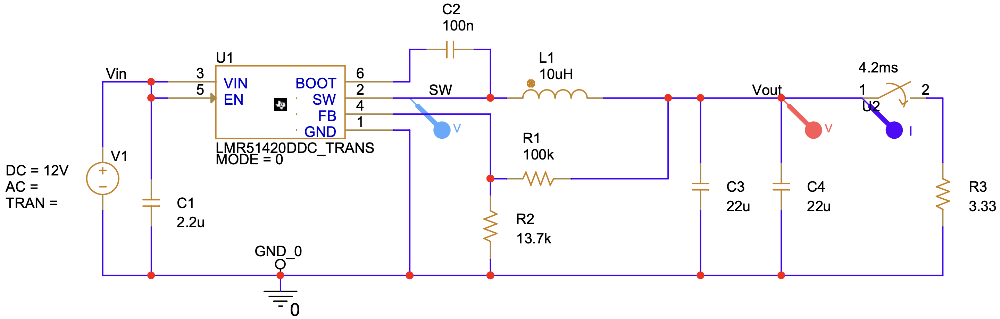

To simulate sudden current loads, a 3.3 Ω load (drawing 1.5 A at 5 V) is added
and set to switch at 4.2 ms. The switch has a transition time of 15 μs.

#### 5.6.2 Output

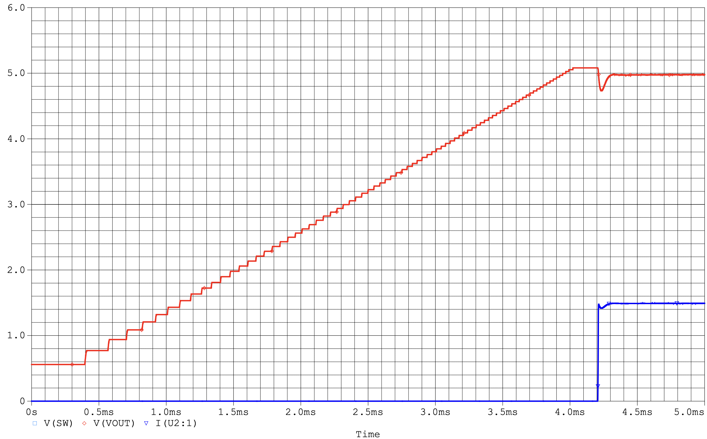

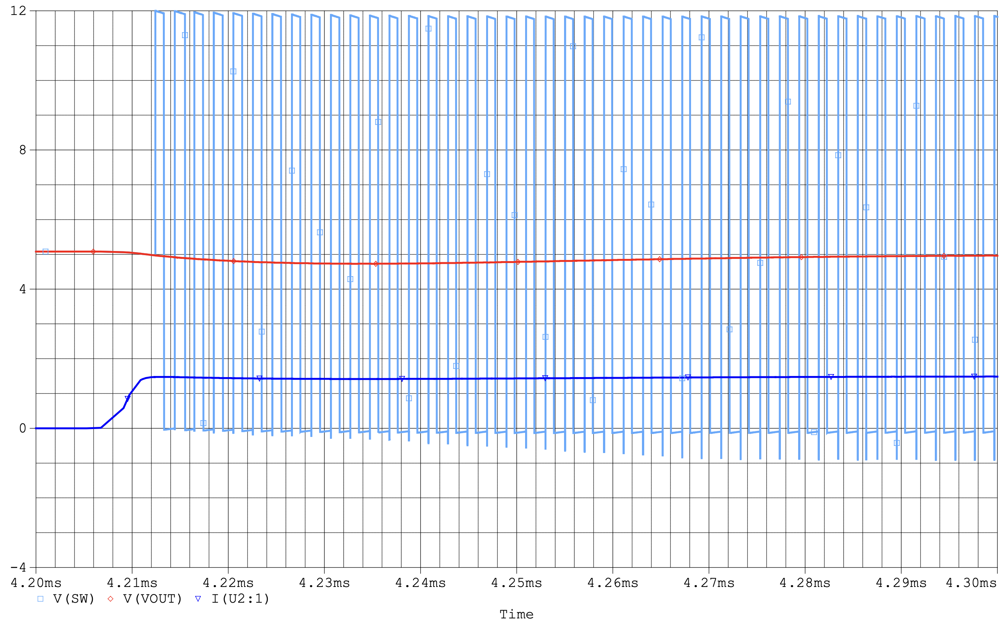

#### 5.6.3 Fast Fourier Transform (FFT)

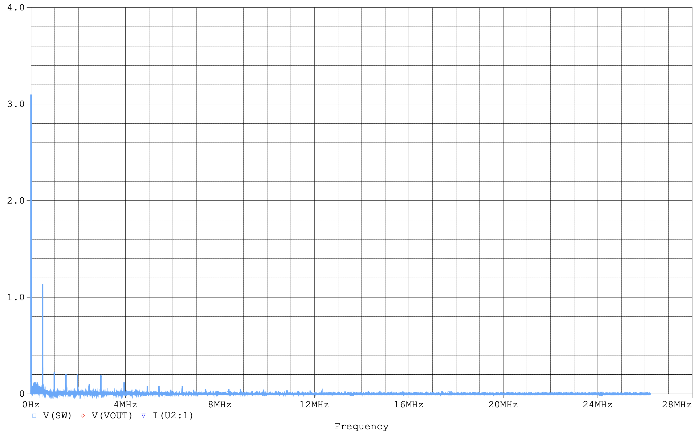

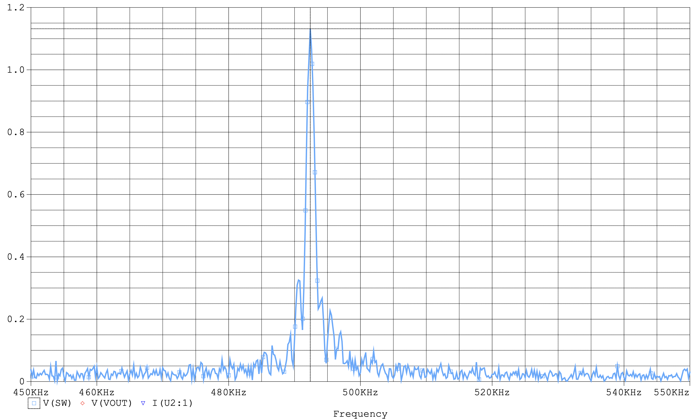

For this simulation run, the fundamental frequency was found to be 492.400 kHz
with a resultant amplitude of 1.1316. Due to the short simulation duration, the
time required to ramp up to the final voltage, and the handling of sudden loads,
it is hypothesized that the FFT results deviate slightly from the expected 500
kHz.

---

## 💖 Sponsors

### PCBWay

This project is sponsored by [**PCBWay**](https://www.pcbway.com), whose PCB
manufacturing services are essential in producing high-quality prototypes for
its development. Their support ensures reliable boards that meet the project's
demands.

#### Why PCBWay?

PCBWay stands out for their exceptional services and commitment to the
community:

- **PCB Manufacturing**: High-quality fabrication with options for multilayer,
  rigid-flex, and advanced designs.
- **PCB Assembly**: Comprehensive solutions, including soldering, component
  sourcing, and assembly.
- **CNC Machining & 3D Printing**: Additional prototyping options to support
  complete product development.
- **Fast Turnaround**: Reliable and quick production times to keep projects on
  schedule.
- **Support for Open Source & Education**: PCBWay actively sponsors projects and
  provides educational resources like tutorials, videos, and documentation,
  empowering developers and hobbyists.
    - This commitment to education and open-source advocacy was a key factor in
      choosing them as a partner 🙂.

Their dedication to professional-grade services and fostering innovation makes
PCBWay an invaluable partner in bringing this project to life.

Learn more here: [Why PCBWay?](https://www.pcbway.com/why.html)
